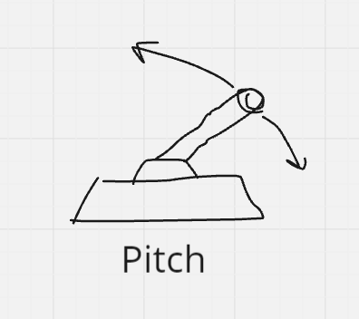

# Embedded-Week-5

Last week you worked on the motor chassis controls which is the bottom half of the robots. This week we will take a look at the top half movements(Pitch, Yaw, Shoot).

## Pitch 

Pitch refers to the up and down movement of the robot's top half. This movement is typically controlled by rotating the structure around a horizontal axis. In robotics, pitch control is crucial for tasks that require precise vertical alignment, such as adjusting the angle of a camera or arm. When you control the pitch, you're essentially changing the tilt of the robot's head or the angle of an attachment.


### Sample Implementation 

```cpp
DJIMotor pitch(7, CANHandler::CANBUS_2, GIMBLY,"Peach");
```
```cpp
desiredPitch += remote.getMouseY() * MOUSE_SENSE_PITCH;
                desiredPitch -= leftStickValue * JOYSTICK_SENSE_PITCH;

                if (desiredPitch >= LOWERBOUND) {
                    // printff("u%f\n",desiredPitch);
                    desiredPitch = LOWERBOUND;
                }
                else if (desiredPitch <= UPPERBOUND) {
                    // printff("d%f\n",desiredPitch);
                    desiredPitch = UPPERBOUND;
                }

                float FF = K * sin((desiredPitch / 180 * PI) - pitch_phase); // output: [-1,1]
                pitch.pidPosition.feedForward = int((INT16_T_MAX) * FF);
                pitch.setPosition(int((desiredPitch / 360) * TICKS_REVOLUTION + InitialOffset_Ticks));

            } else{
                pitch.setPower(0);
            }
```

##  Yaw

Yaw refers to the left and right rotation of the robot's top half around a vertical axis. This movement allows the robot to turn and face different directions without changing its location. Yaw is essential for navigation, aiming, and any situation where the robot needs to adjust its orientation relative to its surroundings.


### Sample Implementation

```cpp
DJIMotor yaw(5, CANHandler::CANBUS_1, GIMBLY,"Yeah");
```

```cpp
yawSetPoint -= remote.getMouseX() * MOUSE_SENSE_YAW;
                if(remote.rightX() > 10 || remote.rightX() < -10){
                    yawSetPoint -= remote.rightX() * JOYSTICK_SENSE_YAW;
                }
```
## Conclusion

Both pitch and yaw are part of the robot's degrees of freedom, which allow it to interact with its environment in more complex ways. Understanding how to control these movements is fundamental for operating the robot effectively in various tasks.

## Shooting

In order for us to shoot, we use a indexer to store our bullets and feed it into a tube which then will use two flywheels to launch the ball out of the barrel. 

Note: Everytime when we shoot a bullet the barrel will "heat up". If we go over a certain threshold then we will loose HP during the match against our opponents. This means that we are not able to spam shots so we would have to develope some sort of timer/buffer that prevents our barrel from overheating.

### Instantiating Fly Wheel and Indexer (Infantry)
```p
DJIMotor indexer(7, CANHandler::CANBUS_2, C610,"Indexer");
DJIMotor RFLYWHEEL(8, CANHandler::CANBUS_2, M3508,"RightFly");
DJIMotor LFLYWHEEL(5, CANHandler::CANBUS_2, M3508,"LeftFly");
```
The code below shows how we implemented the shooting algorithm. 

First, inside the refloop we uses the left switch of our remote to do all the shooting stuff. To begin with the last statement which turns our fly wheel off when the left switch is in DOWN mode. This is the base state where you don't want to shoot. If you move the left switch to MID, it turns on the two fly wheels. This is where you are preparing to shoot. Lastly if you turn the state to UP then you are shooting. Bullets will only come out if you're not on cooldown. Switch between UP and MID for optimal performance. 

```p

if (remote.leftSwitch() == Remote::SwitchState::UP || remote.getMouseL()){
                if (shootReady){
                    shootReady = false;
                    // shoot = true;
                    shootTargetPosition = 8192 * 12 + (indexer>>MULTITURNANGLE);

                    //shoot limit
                    if(robot_status.shooter_barrel_heat_limit < 10 || power_heat_data.shooter_17mm_1_barrel_heat < robot_status.shooter_barrel_heat_limit - 40) {
                        shoot = true;
                    }
                    
                }
            } else {
                //SwitchState state set to mid/down/unknown
                shootReady = true;
            }

            if (remote.leftSwitch() != Remote::SwitchState::DOWN &&
                remote.leftSwitch() != Remote::SwitchState::UNKNOWN){
                RFLYWHEEL.setSpeed(7000);
                LFLYWHEEL.setSpeed(-7000);
            } else{
                // left SwitchState set to up/mid/unknown
                RFLYWHEEL.setSpeed(0);
                LFLYWHEEL.setSpeed(0);
            }
```
## Assignment

Create a simple setup where you can control the pitch and yaw with the remote. Implement a simple shooting code with a timer/buffer. 
